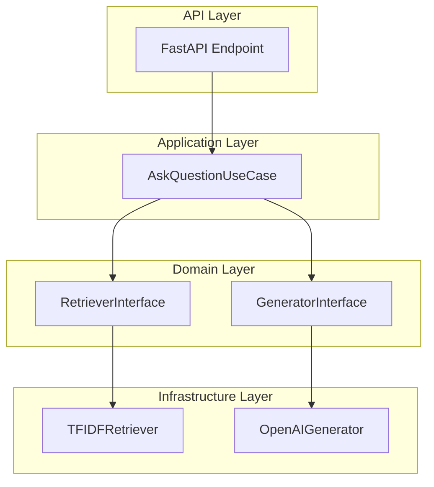
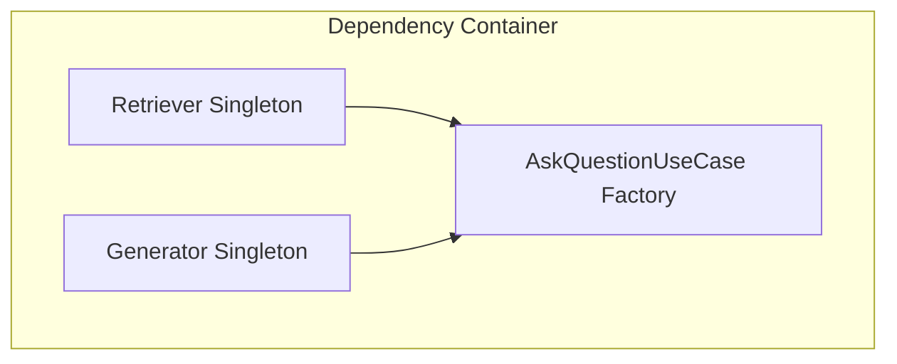
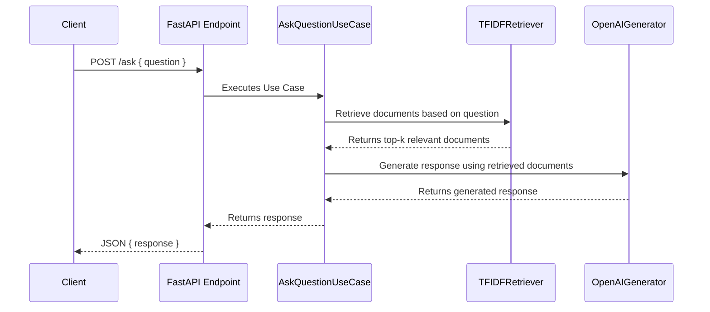

# RAG-Based AI Response System

This project is a **Retrieval-Augmented Generation (RAG) AI Response System** built using **FastAPI**, **Dependency Injector**, and **Uvicorn** to serve a machine learning model that responds to questions based on document retrieval and natural language generation.

## Project Overview

The system has two main components:

1. **Retriever**: Uses a TF-IDF retriever to retrieve the most relevant documents from a corpus based on the input question.
2. **Generator**: Utilizes OpenAI's GPT-3.5 to generate responses based on the retrieved documents, forming a context-aware answer to the question.

The architecture follows **Clean Architecture** principles, organized into domains for each layer. **Dependency Injection** is used for modular and testable design, managed with `Dependency Injector`.

### Key Components

- **FastAPI**: API framework to expose an endpoint for question answering.
- **Uvicorn**: ASGI server to run the FastAPI application.
- **Dependency Injector**: Dependency injection container for managing components in a modular and testable way.
- **Mermaid Diagrams**: Visualizations of system architecture.

---

## Project Structure

```plaintext
rag_project/
├── data/
├── src/
│   ├── api/                    # FastAPI Endpoints
│   │   └── ask_endpoint.py      # Endpoint for question answering
│   ├── application/            # Use cases (business logic)
│   │   └── ask_question_use_case.py
│   ├── config.py               # Configuration settings
│   ├── containers.py           # Dependency injection configuration
│   ├── domain/                 # Interfaces defining business logic
│   │   ├── generator_interface.py
│   │   └── retriever_interface.py
│   ├── infrastructure/         # Implementations of interfaces
│   │   ├── generator.py
│   │   └── retriever.py
│   └── main.py                 # FastAPI app initialization
├── Dockerfile
├── requirements.txt
└── README.md
```

## High-Level Design

### System Architecture



### Dependency Injection Setup



### Data Flow



## Endpoints

* **POST `/ask`**: Accepts a JSON payload with a `question` field. Returns a JSON response with the AI-generated answer.

### Example Request

```
curl -X POST "http://localhost:8000/ask" -H "Content-Type: application/json" -d '{"question": "What is the interest rate for a credit card?"}'
```

### Example Response

<pre class="!overflow-visible"><div class="overflow-y-auto p-4" dir="ltr"><code class="!whitespace-pre hljs language-json">{
    "response": "The interest rate for a savings account is typically around 24-36%, depending on the customer profile."
}
</code></div></pre>

## Setup and Run

### Prerequisites

* Docker
* Docker Compose
* OpenAI API Key

### Installation

1. **Clone the repository**:

`git clone https://github.com/Rocosso/rag_project.git && cd rag_project`.
</code></div></pre><pre class="!overflow-visible"><div class="contain-inline-size rounded-md border-[0.5px] border-token-border-medium relative bg-token-sidebar-surface-primary dark:bg-gray-950"></div></preplain>

2. **Set up environment variables**:

Create a `.env` file in the root with the following content:

`OPENAI_API_KEY=your-openai-api-key`.

3. **Build and Run with Docker**
   `docker compose up -d --build`.
4. **Access the API**:

The API will be available at `http://localhost:8000/ask`.

5. Api documentation and experimentation can be fount in:

   Swagger: `http://localhost:8000/docs#/`

   Redoc: `http://localhost:8000/redoc`
6. Instruccions about Swagger use:

   * create a file .env from .env.example file
   * add your api-key from OpenAI
   * docker-compose up the service in your local
   * in your browser enter to `http://localhost:8000/docs#/`
   * push the Post endpoint that you will use
   * push button "`Try It Out`"
   * replace the question on the value of key "`question`"
   * press `Execute` Blue button
   * watchs the field Response body, in green text is the answuer of model

## Technologies Used

* **Python 3.10**
* **FastAPI**: For building the API endpoint.
* **Uvicorn**: ASGI server for serving the FastAPI application.
* **Dependency Injector**: For managing dependency injection.
* **OpenAI API**: GPT-3.5 model for generating answers.
* **Scikit-learn**: For implementing TF-IDF document retrieval.

## Testing

* create a Virtualenvironment using this command in a terminal
*    `python -m venv venv`
* activate this venv using:

  * in Linux and Mac use:

    `source venv/bin/activate`
  * in Windows use:

```
```

`venv\Scripts\activate`

* install the libraries using:

```
pip install  -r requirements.txt
```

* execute the test using the command:

`pytest`

## 

License

This project is licensed under the MIT License.
